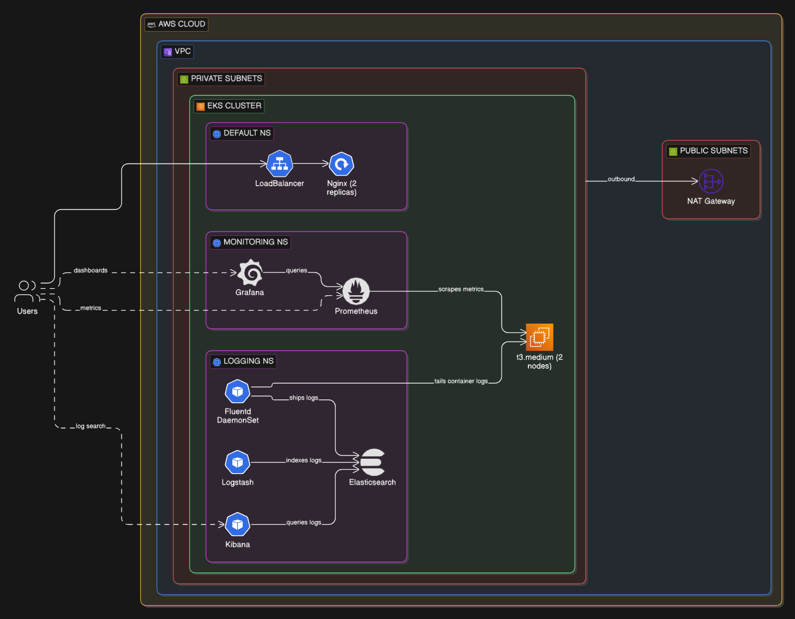
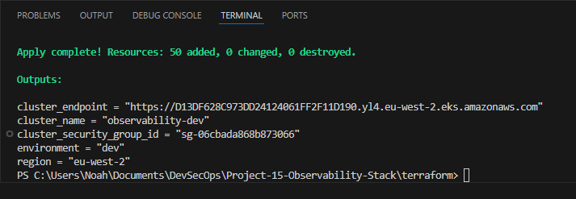
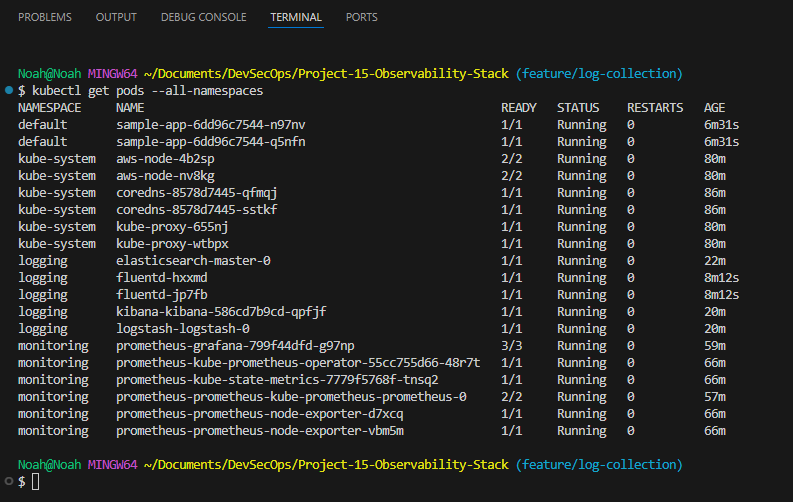

# Kubernetes Observability Stack

A production-style observability platform on AWS EKS that combines metrics monitoring and centralized log aggregation, giving teams a single pane of glass across application health and container logs.

## Overview

In any Kubernetes environment beyond a handful of pods, operators lose visibility fast. Logs scatter across nodes, metrics go uncollected, and debugging production issues turns into guesswork. This project builds the observability layer that solves that — a fully instrumented EKS cluster running Prometheus and Grafana for metrics alongside the ELK stack and Fluentd for centralized logging.

The infrastructure is provisioned entirely through Terraform, creating a VPC with public and private subnets, NAT gateway, and an EKS cluster with managed node groups. On top of that, two Kubernetes namespaces separate concerns: `monitoring` runs the Prometheus and Grafana stack, while `logging` runs Elasticsearch, Logstash, Kibana, and Fluentd as a DaemonSet that tails container logs from every node and ships them to Elasticsearch in near real-time.

A sample Nginx application generates the traffic and logs that flow through both pipelines, demonstrating the full observability loop from application event to dashboard.

## Architecture

The system runs inside a VPC with two availability zones. EKS worker nodes sit in private subnets with outbound access through a NAT gateway, while LoadBalancer services expose Grafana, Kibana, and Prometheus for operator access.

The monitoring pipeline flows from Prometheus scraping pod and node metrics on a pull model, with Grafana querying Prometheus as its datasource for dashboards. The logging pipeline flows from Fluentd DaemonSets tailing `/var/log/containers` on each node, enriching logs with Kubernetes metadata, and forwarding them to Elasticsearch where Kibana provides search and visualization. Logstash sits alongside as a parallel ingestion path accepting beats input on port 5044.

## Tech Stack

**Infrastructure**: AWS VPC, EKS, EC2 (t3.medium managed node group), NAT Gateway, Terraform

**Monitoring**: Prometheus (kube-prometheus-stack), Grafana

**Logging**: Elasticsearch, Logstash, Kibana, Fluentd (DaemonSet with Kubernetes metadata enrichment)

**Orchestration**: Kubernetes 1.29, Helm

## Key Decisions

- **Fluentd DaemonSet over sidecar pattern**: DaemonSets collect logs from all containers on a node without requiring application changes. This mirrors how production teams instrument logging at scale — one agent per node rather than one per pod.

- **Separate monitoring and logging namespaces**: Isolating observability workloads by concern makes RBAC scoping cleaner and prevents resource contention between the metrics and logging pipelines.

- **Single NAT gateway in dev, multi in prod**: The Terraform configuration conditionally deploys one or multiple NAT gateways based on environment, balancing cost in dev against high availability in production.

- **LoadBalancer services for observability tools**: Exposing Grafana, Kibana, and Prometheus via AWS LoadBalancers provides direct operator access without requiring kubectl port-forwarding, reflecting how teams access dashboards in real environments.

## Screenshots

**Terraform Apply Output** — The successful provisioning of the EKS cluster and supporting infrastructure, showing 50 resources added with cluster endpoint, name, security group ID, and region outputs displayed in the terminal.

**EKS Cluster Details** — AWS Management Console view of the observability-dev cluster showing cluster information, resource counts, node group details (aws-node-4b25p with 2/2 nodes running), and the Subnets and Networking tab displaying the infrastructure topology.

**Cluster Pods** — Terminal output of `kubectl get pods --all-namespaces` displaying 19 running pods across default, kube-system, logging, and monitoring namespaces, including Prometheus components, Grafana, Elasticsearch, Kibana, Logstash, Fluentd, and the sample application replicas, each with their container readiness status and uptime.

**Prometheus Targets** — Prometheus web UI showing all monitored targets with their scrape status and health checks, displaying endpoint groups for Kubernetes API server, kubelet, node-exporter, and prometheus itself, all showing green "UP" status indicating successful metric collection.

**Grafana Dashboards** — Grafana monitoring dashboard displaying system metrics including CPU usage (2.07%), load averages (13.0%), memory utilization (21.8%), and time-series graphs for CPU and memory trends across the cluster over the monitoring period.

**Kibana Welcome Home** — Kibana landing page showing the four main features: Enterprise Search, Observability, Security, and Analytics, along with management sections for permissions, dev tools, and index lifecycle management, ready for log exploration.

**Kibana Discover Logs** — Kibana's Discover view displaying 41,221 log entries with a detailed timeline and log records visible, showing timestamps, Kubernetes metadata enrichment, and containerized application log messages flowing from Fluentd through Elasticsearch.

**GitHub Repository Branches** — Project repository showing five active feature branches (feature/documentation, feature/log-collection, feature/logging-stack, feature/monitoring-stack, and feature/terraform-infrastructure) with their update times and associated pull requests, demonstrating the development workflow.

## Author

**Noah Frost**

- Website: [noahfrost.co.uk](https://noahfrost.co.uk)
- GitHub: [github.com/nfroze](https://github.com/nfroze)
- LinkedIn: [linkedin.com/in/nfroze](https://linkedin.com/in/nfroze)
